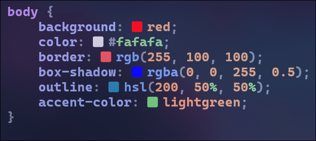
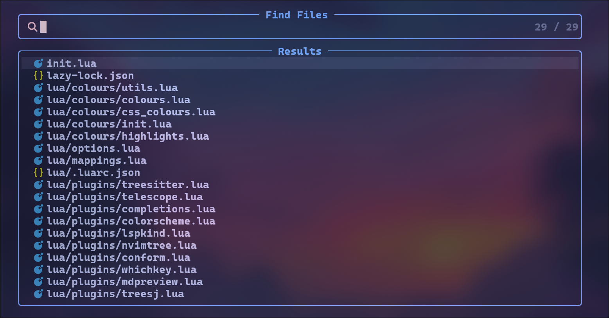
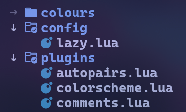

<div align="center">

# colours.nvim

A beatiful way to display colours in neovim.



</div>

## Dependencies

1. [Nerd Fonts](https://www.nerdfonts.com/).
2. [telescope.nvim](https://github.com/nvim-telescope/telescope.nvim) (optional).
3. [nvim-tree.lua](https://github.com/nvim-tree/nvim-tree.lua) (optional).

## Installation

### [lazy.nvim](https://github.com/folke/lazy.nvim)

```lua
{
    "nilsojunior/colours.nvim",
}

-- Or with dependencies
{
	"nilsojunior/colours.nvim",
	dependencies = {
		"nvim-telescope/telescope.nvim",
		"nvim-tree/nvim-tree.lua",
	},
}
```

## Config File

You can change the icon and the highlight colours.

```lua
require("colours").setup() -- Default config

-- Changing defaults
require("colours").setup({
    icon = " ",
    colours = {
        foreground = "#4881db",
        background = "#abb5c4",
    },
})
```

## Telescope

Highlight current file.



## Nvim Tree

Highlight arrow on opened folders.


